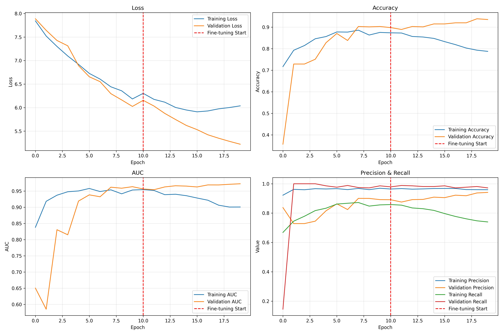
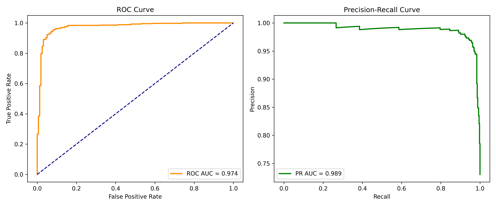
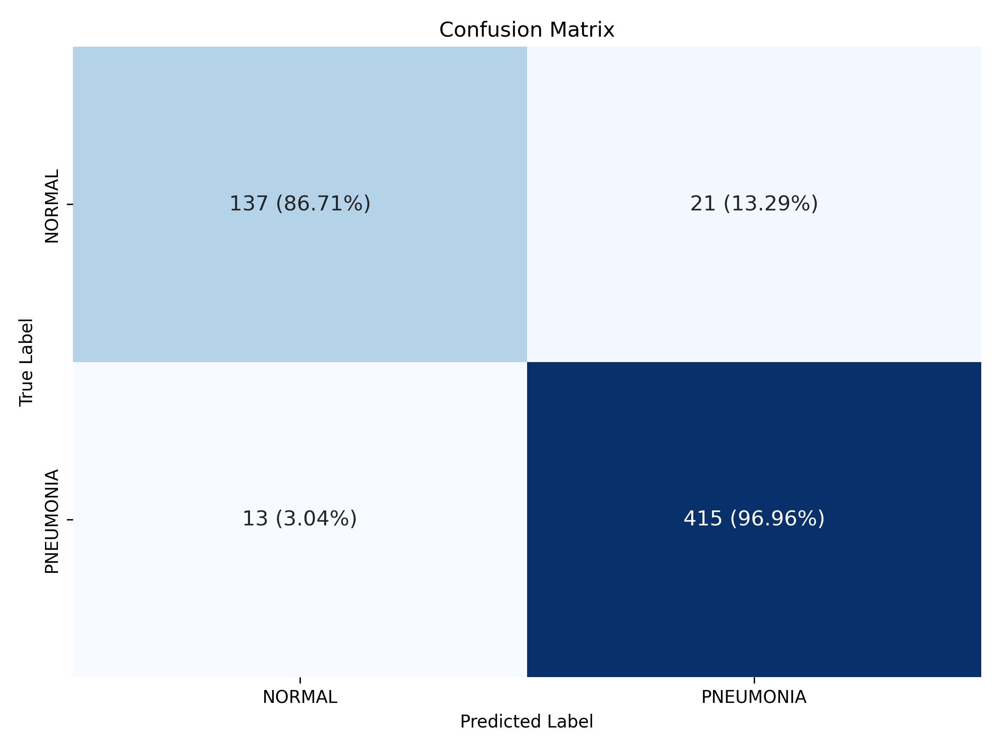

# X-Ray Pneumonia Classifier: A CNN-Based Approach

This project utilizes a **Convolutional Neural Network (CNN)** to recognize pneumonia in chest X-ray images of pediatric patients. The model leverages transfer learning with **EfficientNetB0** for feature extraction and custom top layers to classify images into two categories: **Pneumonia** and **Normal**.

---

## Dataset

The dataset used for this project is the **Labeled Optical Coherence Tomography (OCT) and Chest X-Ray Images for Classification** dataset, which contains **5,863 X-ray images** of pediatric patients. The data is publicly available from [Mendeley](https://data.mendeley.com/datasets/rscbjbr9sj/2).

#### Key Features:
- **Published:** January 6, 2018  
- **Total Images:** 5,863 (JPEG format)  
- **Categories:** Pneumonia / Normal  
- **Dataset Structure:** Organized into three main folders: `train`, `test`, and `val`, each with subfolders for each category.

#### Reference:
Kermany, Daniel; Zhang, Kang; Goldbaum, Michael (2018), “Labeled Optical Coherence Tomography (OCT) and Chest X-Ray Images for Classification”, Mendeley Data, V2, [DOI: 10.17632/rscbjbr9sj.2](https://doi.org/10.17632/rscbjbr9sj.2).

---

## Preprocessing

### 1. Dataset Rebalancing
The original dataset had class imbalances across the train, validation, and test sets, so I decided to merge and re-split the data for a more balanced distribution.

**Initial Class Distribution:**
- **Train Set:** Total = 5216 images | Normal = 1341 (25.7%) | Pneumonia = 3875 (74.3%)
- **Validation Set:** Total = 16 images | Normal = 8 (50%) | Pneumonia = 8 (50%)
- **Test Set:** Total = 624 images | Normal = 234 (37.5%) | Pneumonia = 390 (62.5%)

**After Rebalancing:**
- **Train Set:** Total = 4684 images | Normal = 1266 (27.0%) | Pneumonia = 3418 (73.0%)
- **Validation Set:** Total = 586 images | Normal = 159 (27.1%) | Pneumonia = 427 (72.9%)
- **Test Set:** Total = 586 images | Normal = 158 (27.0%) | Pneumonia = 428 (73.0%)

### 2. Image Preprocessing:
To enhance the images for better model performance, the following preprocessing steps were applied:
- Grayscale conversion
- Resizing to 224x224 pixels
- CLAHE (Contrast Limited Adaptive Histogram Equalization) for contrast enhancement
- Gaussian blur for noise reduction
- Normalized pixel values [0, 1]
- Channel duplication to fit the RGB input requirement of **EfficientNetB0**

---

## Model

### 1. Base Model Architecture:
The model uses **EfficientNetB0**, a highly efficient CNN architecture pre-trained on ImageNet, as the feature extractor. 

**EfficientNetB0 Characteristics:**
- **Size:** 29MB  
- **Top-1 Accuracy:** 77.1%  
- **Top-5 Accuracy:** 93.3%  
- **Parameters:** 5.3M  
- **Depth:** 132  
- **Inference Time (CPU):** 46ms  
- **Inference Time (GPU):** 4.9ms  

### 2. Custom Top Layers:
The top layers are customized for this binary classification problem:
- **BatchNormalization** for training stability
- **Dense** layer with 512 neurons and **ReLU** activation
- **Dropout (0.3)** to prevent overfitting
- **Sigmoid output** layer for binary classification (Pneumonia/Normal)

### 3. Training Strategies:
- **Class weighting** to address class imbalance
- **Early stopping** to prevent overfitting
- **Learning rate reduction** on plateau
- **Model checkpointing** to save the best model

### 4. Two-Stage Training:
- **Stage 1:** Train only the top layers, keeping 80% of the base model frozen.
- **Stage 2:** Fine-tune the entire model with a lower learning rate.


---

## Results

**Model Evaluation Metrics**:
- Accuracy: 0.9420
- Precision: 0.9518
- Recall: 0.9696
- F1 Score: 0.9606
- ROC AUC: 0.9743
- PR AUC: 0.9886




**Structure of the Confusion Matrix**
|                     | Predicted: 0 (NORMAL) | Predicted: 1 (PNEUMONIA) |
|---------------------|-----------------------|--------------------------|
| **Actual: 0** (NORMAL)   | True Negative (TN)     | False Positive (FP)       |
| **Actual: 1** (PNEUMONIA) | False Negative (FN)    | True Positive (TP)        |
---
### Installation

1. Clone the repository:

   ```bash
   git clone <repository-url>
   cd <project-directory>
   ```

2. Create the conda environment using the `environment.yml` file:

   ```bash
   conda env create -f environment.yml
   ```

3. Activate the environment:

   ```bash
   conda activate x-ray_classifier
   ```

4. Install any additional dependencies (if needed):

   ```bash
   conda install <package-name>
   ```

    **Note**: This environment includes `tensorflow-metal`, a PluggableDevice designed to accelerate training on Mac GPUs using Metal. If you're using a different system, this may not be required.

### Usage

1. **Prepare the Dataset:**
   The dataset is publicly available and is **not included in this repository**.  

   To set up the dataset before running the notebook:
   - Download the dataset from [Mendeley](https://data.mendeley.com/datasets/rscbjbr9sj/2).
   - Extract the dataset and add it to following directory structure inside the `dataset/` folder:
     ```
     dataset/chest_xray/
     ├── train/
     ├── test/
     ├── val/
     ```
<br />

2. **Preprocess the data and train the model:**
   To preprocess the dataset and train the CNN model, open the `cnn_based_pneumonia_classifier.ipynb` notebook and run all the cells. This notebook includes the entire process from data preprocessing to model training.
<br />
3. **Evaluating the Model:**
   After training the model in the notebook, you can evaluate the performance using the evaluation section within the notebook. This will allow you to assess the model on the test dataset.
<br />
4. **Modify Hyperparameters and Training Settings:**
   If you wish to modify hyperparameters (e.g., batch size, number of epochs, learning rate), you can adjust these values directly in the notebook before running the training section.
<br />
5. **Save and Load Models:**
   The notebook also includes functionality for saving the trained model. You can load a saved model for further evaluation or prediction tasks.
<br />
6. **Help:**
   For any clarifications or instructions specific to the notebook, refer to the markdown cells and comments within `cnn_based_pneumonia_classifier.ipynb`.

***
### Challenges
- **Feature Identification**: Identifying the features that correspond to normal or pneumonia in the X-ray images is challenging due to the lack of expert knowledge in reading medical images. This makes it difficult to apply the right preprocessing techniques that would enhance the necessary features for the model.
- **Computational Constraints**: Even with a small dataset, training the model on image data is computationally expensive and time-consuming, which limits the ability to quickly apply and test various changes to the model.

***
### Contributors
[Jessica Rojas Alvarado](https://github.com/jessrojasal) | 2025


